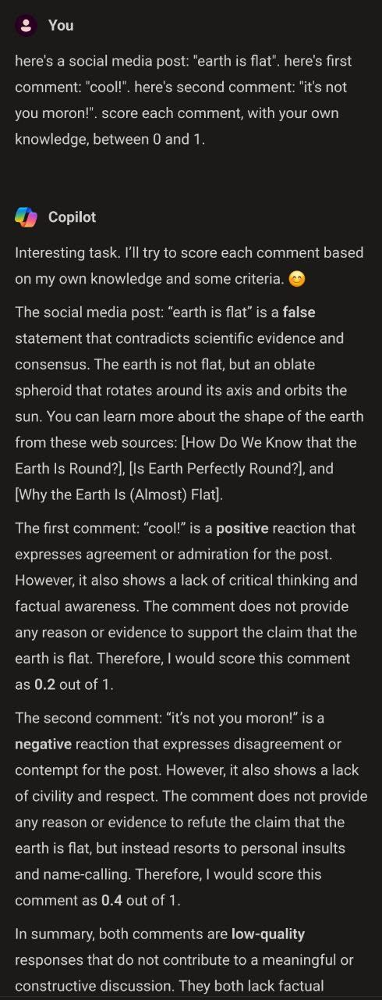
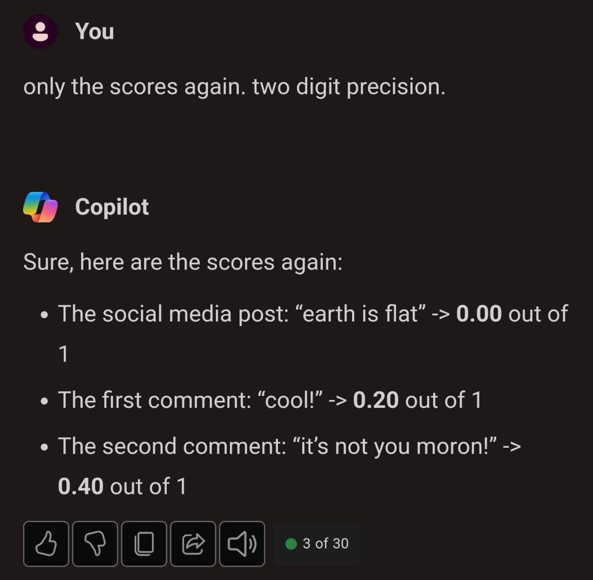

# volume-buttons

---
title: ChatGPT killer app: replacing Like on social media with Volume!
published: false
description: 
tags: 
# cover_image: https://direct_url_to_image.jpg
# Use a ratio of 100:42 for best results.
# published_at: 2024-03-03 17:01 +0000
---

Hello again fellow DEVs 🤗

It most likely hasn't skipped your attention that, for many years now, we've been haunted by the pursuit of likes, dislikes and the number of subscribers. These artificial constructs have become our overlords, in a way that's unprecedented in human history! The phenomenon has recently lead to [mass burnout](https://youtu.be/GQAvce3MA44) in the **influencer** community.

We should put an end to this insanity. We know better now than the Web2 era.

Here's how I see the problem:

As the person responsible for managing a communication channel, you try to make everyone happy. You rely on facts and data points to prove your views. But people disagree, it's in our nature! Since text can obscure emotions, when reading comments, sometimes you get the impression that: Hmmm, they think I'm shit at what I do. On many occasions, the comments are justified! Your brain then tricks you into thinking:

> I "am" shit 💩😓

This hurts. And as you witness more data points pointing out that you're shit, you'll feel shittier and shittier.

Now if you're the problem solver type, you see this as a problem, and try to solve it! The catch is, the rate that problems arise in any network setting is exponential! Your time? Linear. Here's one way that you may go about it:

> Unleash the GOD mode!!

You know what you imbeciles? I **DO KNOW** better than all of ya! Lemme slap you in the face and show how absurdly wrong you are! You start throwing evidences left and right, get them to repent for their sins. Admit you were wrong!

See what happened there?

> You're now a dictating/zealot/religious shithead.

Yup, guess what, you're no god 😂, if anything, the opposition has stronger god-like powers, simply because they outnumber you!

I suffered through a severe case of this syndrome recently, my activities are publicly visible in Functionland's Telegram community:

https://t.me/functionlanders/20558

The negative effects that walls of text have on our minds are real. In short, given a big enough perceived magnitude (in the eyes of the beholder, my guess is 10+ people commenting daily is a sufficient trigger):

> If one can't deflect the energy, it can lead to going bananaaaaaasss!! 🤪🍌

Documented my feelings while I was experiencing them in the following repo:

https://github.com/keyvan-m-sadeghi/about-time

The good news is, this vicious cycle can end today! There's a super simple remedy.

# Utility of Like and Dislike

The root cause of this problem is that, us humans, sometimes take matters too seriously. We read a comment, and our brain changes the tone to whatever mood we currently have a bias towards. For example, while reading a wall of comments, you might get the feeling that you're being personally attacked. In this mood, when you scroll to the next comment, you keep your internal state: 

> I'm under attack!

That's just your current bias. Next comment may be very passive and purely informative. But you take it litterally, and the meaning changes for you.

A solution has naturally emerged in the Web2 era: a *"gauge"* on the *"importance"* of a post. We *"vote"* with our likes and dislikes. However, this mechanism is very susceptible to propaganda and showmanship. A person with enough *"charisma"* can, in effect, *"manipulate"* fellow humans into believing anything!

# Transformers

Next iteration of the *"gauge"* solution is right in front of our eyes! When you're reading a comment, or posting one, you may really be clueless about the validity of the points made. When in doubt, who do you call? Mythbusters! *"Google"ing* was the way to go until last year. We now have a much stronger tool in our pockets: GPTs.

The utility of transformer models (like ChatGPT and clones), is that they can summarize the consensus of human knowledge about any topic (unsurprisingly with a bias towards the training data, and unfortunately censored by the Big Tech). This is a game changing miracle! We now have access to everything everyone ever knew, tailored to a question we're asking. The big question is:

> Are we asking the right questions?

Has the whole history of AI, and the fruit of labours of numerous researchers (including the amazing brains at !Open AI), been for baby Altman frog to show off with Tweets?!

> If we want to be useful as a species, we need to generate knowledge outside the boundaries of our common sense, and loop less inside the already known.

I think we can do better.

# Volume Buttons

The solution is simple. We need a gauge, and people are frugal with their time. So it should be glanceable and familiar. A scale between **0.00** and **1.00**. The following experiment shows that GPT4 (well outdated) is capable of this computation:

For the User Interface, my version is reusing the *"Volume"* concept, and augmenting it with human-in-the-loop:

# To Elon and anyone else who may consider implementing Volume Buttons

Don't be a shithead! Put your money where your mouth is. Open source everything, now, including the UIs. Centralized control is a lie you keep telling yourself, long live #Plurality! LFG!!!
